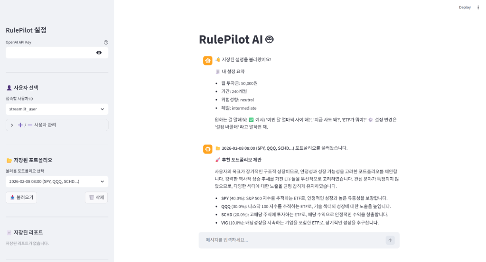
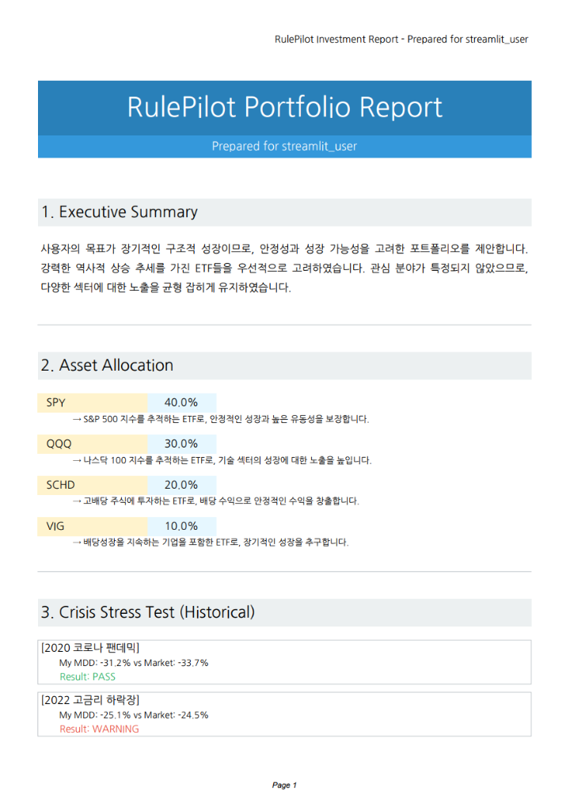
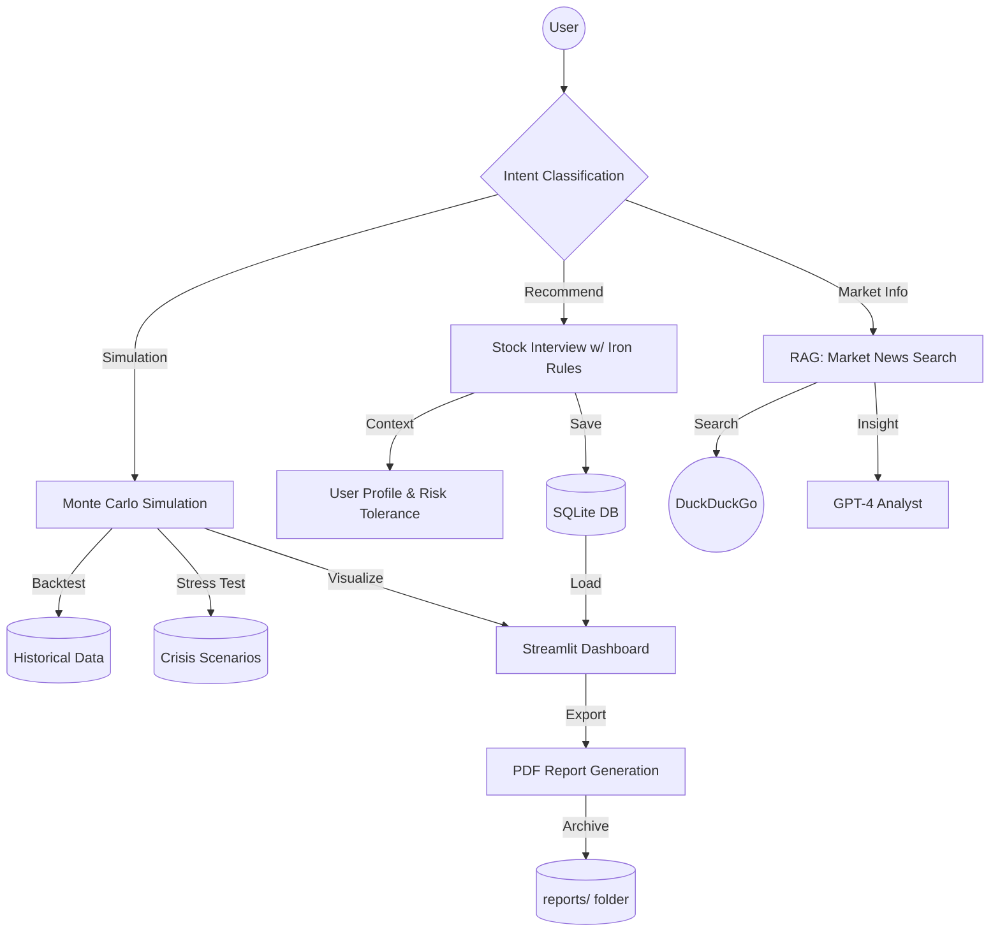

<div align="center">

# ✈️ RulePilot: Agentic AI Investment Assistant
### "원칙을 지키는 투자의 시작, RulePilot"


</div>

---

## 📖 소개 (Introduction)

**RulePilot**은 워렌 버핏의 투자 철칙(**"Rule No.1: 돈을 잃지 마라"**)을 준수하도록 설계된 **에이전트 기반(Agentic) AI 투자 비서**입니다.

사용자의 투자 성향을 분석하고, 실시간 시장 데이터를 바탕으로 포트폴리오를 제안하며, 과거 위기 상황(2008 금융위기, 2020 코로나 팬데믹 등)에서의 스트레스 테스트를 통해 **안전한 투자**를 최우선으로 가이드합니다.

> **핵심 철학**
> - 🤖 **Agentic Workflow**: 정교한 상태 머신(LangGraph) 위에서 동작하여 LLM 환각을 방지
> - 🛡️ **Iron Rules**: 투기성 종목 추천을 거부하고, 리스크 관리를 시스템 레벨에서 강제
> - 📊 **Data-Driven**: 실시간 뉴스(RAG)와 퀀트 데이터를 결합한 근거 기반 답변

---

## 📸 스크린샷 (Screenshots)

### 🖥️ 메인 화면 & 포트폴리오 추천


### 📄 전문 투자 보고서 (PDF Export)


---

## ✨ 주요 기능 (Features)

### 📋 포트폴리오 추천 & 관리
- **대화형 인터뷰**: 투자 목표, 리스크 성향, 선호 섹터를 자연어로 수집
- **Iron Rules 적용**: 투기성 종목(레버리지 ETF 과다 비중 등) 자동 차단
- **저장 및 불러오기**: 추천된 포트폴리오를 데이터베이스에 저장하고 사이드바에서 언제든 재사용 가능
- **삭제 기능**: 저장된 포트폴리오를 즉시 삭제하여 아카이브 관리

### 📰 실시간 시장 분석 (RAG)
- **DuckDuckGo 검색**: "시장 어때?", "TQQQ 어때?" 같은 질문에 최신 뉴스 검색
- **GPT-4 분석**: 검색 결과를 요약하고 리스크 관점에서 해석
- **동적 쿼리 생성**: 일반 시장 질문과 특정 종목 질문을 자동 구분

### � 몬테카를로 시뮬레이션
- **과거 성과 백테스트**: 역사적 데이터를 기반으로 포트폴리오 성과 재현
- **미래 예측**: 90% 신뢰구간으로 향후 자산 가치 범위 시뮬레이션
- **Interactive Charts**: Plotly 기반 차트로 확대/축소 및 세부 데이터 분석 가능

### � 위기 스트레스 테스트
- **역사적 위기 시나리오**: 2008 금융위기, 2020 코로나 팬데믹, 2022 고금리 하락장 등
- **MDD 비교**: 내 포트폴리오의 최대낙폭(MDD)을 시장(S&P 500)과 비교
- **방어력 평가**: PASS/WARNING 결과로 리스크 관리 성과 즉시 확인

### 📄 전문 PDF 리포트
- **원클릭 생성**: 시뮬레이션 결과를 즉시 PDF로 다운로드
- **디자인 적용**: 색상, 구분선, 박스, 아이콘으로 가독성 극대화
  - 파란색 헤더, 회색 섹션 구분, 노란색/하늘색 종목 하이라이트
  - 초록색(PASS)/빨간색(WARNING) 색상 코딩
  - 경고 박스(면책조항)
- **저장 및 아카이빙**: 생성된 리포트를 `reports/` 폴더에 자동 저장하고 사이드바에서 재다운로드 가능
- **삭제 기능**: 불필요한 리포트를 즉시 삭제

---

## 🏗️ 아키텍처 (Architecture)



---

## 💡 기술 스택 (Tech Stack)

<details>
<summary><b>더보기 (Click to expand)</b></summary>

### Backend & AI
- **Python 3.13**: Core Logic
- **LangChain & LangGraph**: State-based Agent Orchestration
- **OpenAI GPT-4**: Reasoning & Generation
- **SQLite**: User Data & Portfolio Persistence

### Frontend & Visualization
- **Streamlit**: Interactive Web UI
- **Plotly**: Dynamic Financial Charts
- **Altair**: Data Visualization

### Tools & Utils
- **DuckDuckGo Search**: Real-time Information Retrieval (RAG)
- **FPDF2**: Automated PDF Report Generation with Design
- **Pandas & NumPy**: Quantitative Analysis

</details>

---

## 🚀 시작하기 (Getting Started)

### 1. 설치 (Installation)
```bash
# Repository 클론
git clone https://github.com/DongHyun925/RulePilot.git
cd RulePilot

# 패키지 설치
pip install -r requirements.txt

# 환경 변수 설정 (.env 파일 생성)
echo "OPENAI_API_KEY=your_api_key_here" > .env
```

### 2. 실행 (Run)
```bash
# Streamlit 앱 실행
streamlit run app.py
```

### 3. 주요 사용 흐름
1. **프로필 설정**: 사이드바에서 사용자 이름 선택 또는 신규 생성
2. **투자 계획 수립**: "투자 계획 세워줘"라고 입력하여 인터뷰 시작
3. **포트폴리오 저장**: AI 추천 후 "네"라고 응답하여 저장
4. **시뮬레이션 보기**: "시뮬레이션 보여줘"로 과거 성과 및 미래 예측 확인
5. **리포트 생성**: "📄 리포트 다운로드" 버튼 클릭 → "💾 리포트 저장하기" 클릭
6. **아카이브 관리**: 사이드바에서 저장된 포트폴리오/리포트 불러오기 및 삭제

---

## 🇬🇧 English Description

<details>
<summary><b>Click to read in English</b></summary>

### RulePilot: The Agentic AI Investment Assistant

**RulePilot** is an intelligent investment assistant built with a **"Safety First"** philosophy, adhering to Warren Buffett's golden rule: **"Rule No.1: Never lose money."**

#### Key Features
- **Agentic Workflow**: Built with **LangGraph** to manage complex conversational states and prevent LLM hallucinations
- **RAG Market Briefing**: Integrated **DuckDuckGo Search** to fetch and analyze real-time market news
- **Quantitative Simulation**: Monte Carlo simulations and **Crisis Stress Tests** (2008 Financial Crisis, 2020 COVID-19, etc.)
- **Professional PDF Reports**: Generate beautifully designed investment reports with colors, borders, and visual hierarchy
- **Archive System**: Save and manage portfolios and reports with easy-to-use sidebar controls

#### How it Works
The system uses a **Router** to classify user intent (Recommendation, Simulation, Market Info) and directs requests to specialized agents. It combines LLM reasoning with strict quantitative logic to ensure safe and reliable investment advice.

#### Tech Highlights
- **State Machine**: LangGraph ensures structured, predictable conversation flows
- **Iron Rules**: System-level enforcement prevents speculative recommendations
- **Data-Driven**: Combines real-time news (RAG) with quantitative metrics (MDD, Volatility)

</details>

---

## 📝 License

This project is licensed under the MIT License.

## 👨‍💻 Author

**DongHyun Hwang**  
GitHub: [@DongHyun925](https://github.com/DongHyun925)
